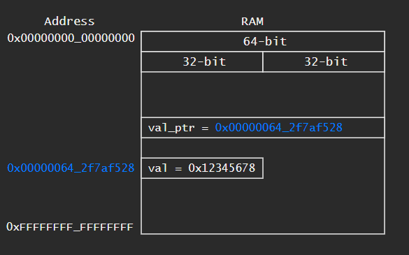
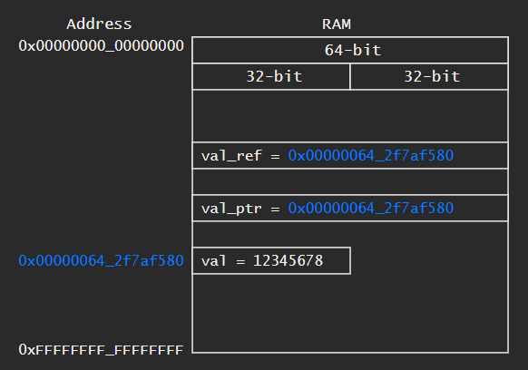
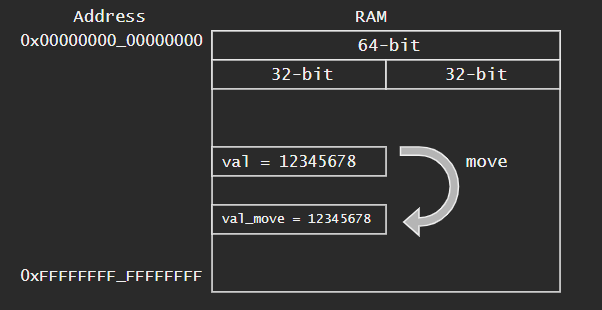
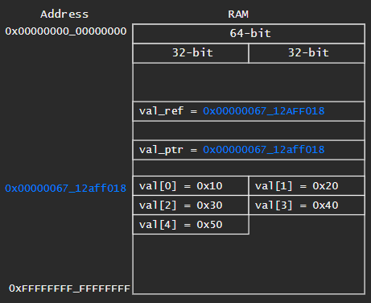
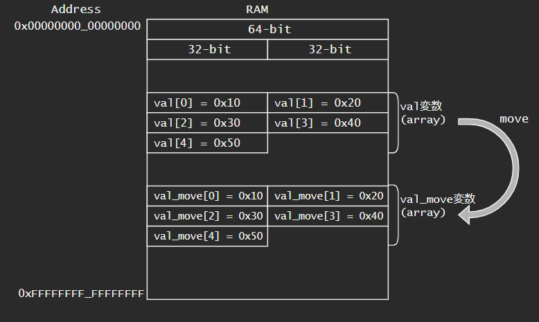
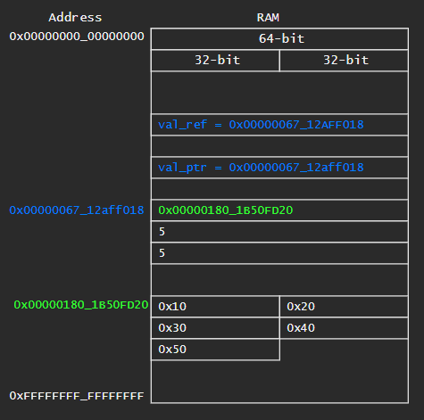
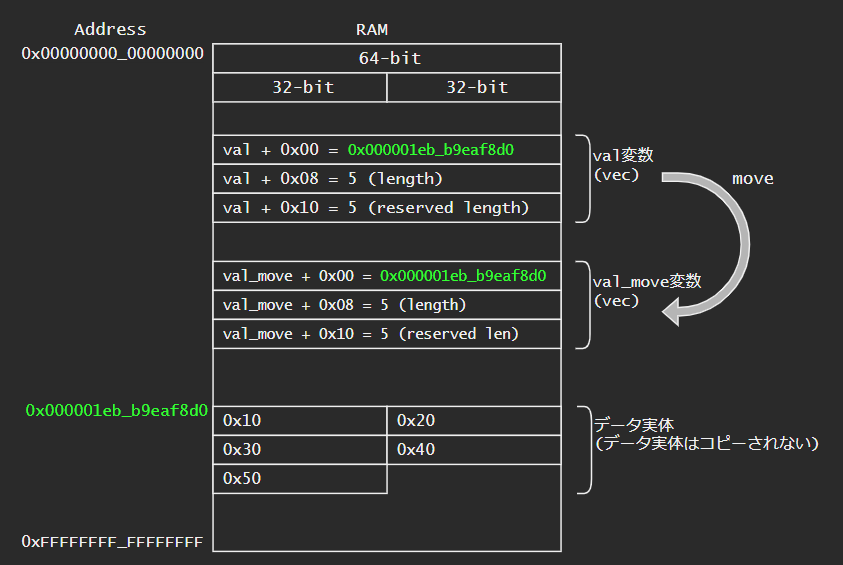
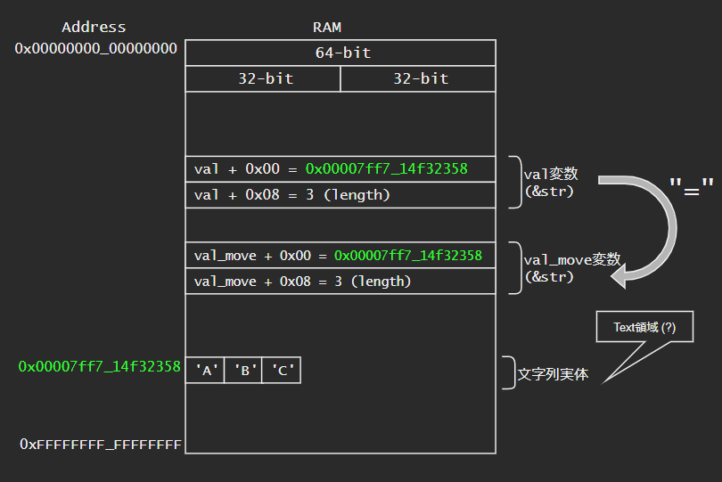
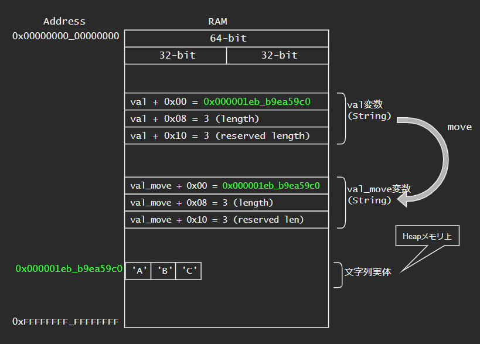
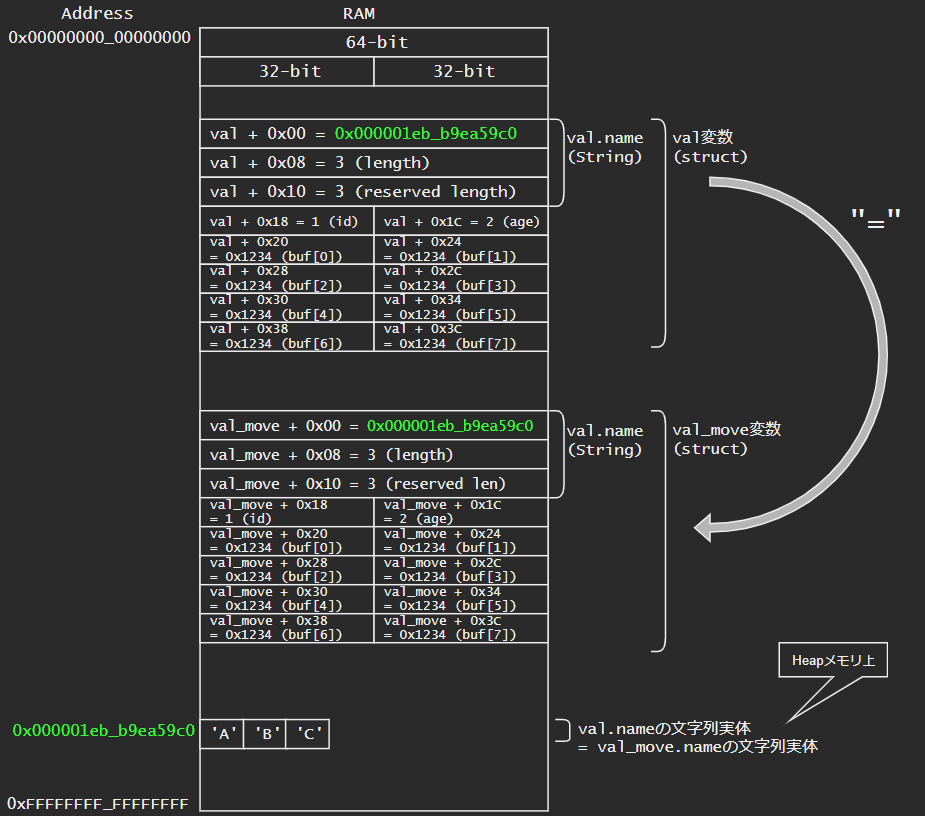

# Rustの変数がメモリ上でどのように配置されて、moveしたときにどのような挙動をするか

- Rustの変数がメモリ上でどのように配置されて、moveしたときにどのような挙動をするかを調べました
- 所有権とかRust的なことは置いといて、実際にデータがどのように扱われているかが分からないと気持ちが悪いという人向けの記事です。(主にC/C++プログラマ向け)。
- 注意: 下記の64-bit環境で実行した結果を記載しています。実装依存な結果も含まれているかと思われます。

## 環境
- Intel Core i7-6700
- Windows10 Home 64-bit
- rustc 1.55.0

## まとめ
- おおむねC/C++と同じ。本記事の範囲だと、参照と配列(array)が少し異なる
- moveの際
    - i32等の基本型、配列(array)はデータそのものがコピーされる
        - 構造体内に上記型のメンバがある場合も同じ
        - なので、大きい配列のmoveは要注意
    - vec、&str、Stringは管理情報はコピーされるが、データ実体(ヒープ領域上に確保される)はコピーされない

## ノート
- Assemblyコードを出力する方法 (https://stackoverflow.com/questions/39219961/how-to-get-assembly-output-from-building-with-cargo )

```powershell
$env:RUSTFLAGS="--emit asm"
cargo build --release
```

```bash
RUSTFLAGS="--emit asm" cargo build --release
```

# ポインタの基本操作
## 変数のポインタ取得
- ポインタ型は`*const i32` 、または`*mut i32` 。`&val` から受ける際に型指定しないと参照型になってしまうので要注意
    - `*mut _` や`*const _` で一部省略して受けることは可能
- 64-bitコンピュータの場合、ポインタ型のサイズは8Byte (64-bit)




```rust:コード
let val: i32 = 0x12345678;
let val_ptr: *const i32 = &val;
println!("val = 0x{:08X}, sizeof(val) = {}", val, std::mem::size_of_val(&val));
println!("val_ptr = {:?}, sizeof(val_ptr) = {}", val_ptr, std::mem::size_of_val(&val_ptr));
```

```txt:実行結果
val = 0x12345678, sizeof(val) = 4
val_ptr = 0x642f7af528, sizeof(val_ptr) = 8
```

## ポインタの操作
- ポインタ型経由でメモリにアクセスする場合には `unsafe` ブロック内で行う
- ポインタの加算は `add` を使う。+1で型のサイズ分アドレスが加算される(例. i32の場合+4)

```rust:コード
let mut val: i32 = 0x12345678;
let val_ptr: *mut i32 = &mut val;
println!("val = 0x{:08X}, val_ptr = {:?}", val, val_ptr);
unsafe {
    *val_ptr += 1;
    println!("*val_ptr + 1 = 0x{:08X}", val);
    println!("val_ptr.add(1) = {:?}", val_ptr.add(1));
    // println!("val_ptr + 1 = {:?}", val_ptr + (1 as *mut i32));  // Error:  cannot add `*mut i32` to `*mut i32`
}
```
```txt:実行結果
val = 0x12345678, val_ptr = 0x642f7af580
*val_ptr + 1 = 0x12345679        # 0x12345678 + 1 = 0x12345679
val_ptr.add(1) = 0x642f7af584    # 0x642f7af580 + sizeof(i32) = 0x642f7af584
```

## ポインタのキャスト
- `as` でキャストする
- `*const _` から`*mut _` へのキャストもできた

```rust:コード
let val: i32 = 0x12345678;
let val_ptr: *const i32 = &val;
let val_u8_ptr: *mut u8 = val_ptr as *mut u8;
println!("val = 0x{:08X}, val_ptr = {:?}, val_u8_ptr = {:?}", val, val_ptr, val_u8_ptr);
unsafe {
    for i in 0..4 {
        println!("val_u8_ptr.add({}) = {:?}, val = 0x{:02X}", i, val_u8_ptr.add(i), *val_u8_ptr.add(i));
    }
    *val_u8_ptr += 1;
}
println!("val = 0x{:08X}, val_ptr = {:?}, val_u8_ptr = {:?}", val, val_ptr, val_u8_ptr);    // Immutable valiable is broken
```
```txt:実行結果
val = 0x12345678, val_ptr = 0x642f7af588, val_u8_ptr = 0x642f7af588
val_u8_ptr.add(0) = 0x642f7af588, val = 0x78
val_u8_ptr.add(1) = 0x642f7af589, val = 0x56
val_u8_ptr.add(2) = 0x642f7af58a, val = 0x34
val_u8_ptr.add(3) = 0x642f7af58b, val = 0x12
val = 0x12345679, val_ptr = 0x642f7af588, val_u8_ptr = 0x642f7af588
```

## 数値からポインタへのキャスト
```rust:コード
unsafe {
    /* immutable */
    let ptr: *const u32 = 0x0000_0000_0000_0000 as *const u32;
    println!("{}", *ptr);

    /* mutable */
    let ptr: *mut u32 = 0x0000_0000_0000_0000 as *mut u32;
    *ptr = 0xdeadbeef;
}
```
```txt:実行結果
error: process didn't exit successfully: `target\debug\test_memory.exe` (exit code: 0xc0000005, STATUS_ACCESS_VIOLATION)
```

# i32
## i32のメモリ配置
- `let val: i32 = 0x12345678;`
- i32変数(`val` )のサイズは32-bit
- ポインタ型(`val_ptr` )のサイズは8Byte (64-bit)。(64-bitコンピュータの場合)
- 参照型(`val_ref` )のサイズは8Byte (64-bitであり)、参照先 (`val` )へのアドレスが格納されている
- 参照型(`val_ref` )をそのまま使うと、参照先 (`val` )同等に扱える
    - `val_ref` と `*val_ref` の評価結果は同じになる
    - そのため、参照型(`val_ref` )に格納されているアドレスを直接見ることはできない(`val` の値が取れてしまうため)。下記コードではわざわざ参照型変数へのポインタ(`val_ref_ptr` )を `*const usize`に変換して中身を見ている



<details><summary>お試しコードと実行結果</summary><div>

```rust:コード
let val: i32 = 0x12345678;
let val_ptr: *const i32 = &val;
let val_ref: &i32 = &val;
let val_ref_ptr: *const &i32 = &val_ref;

println!("val = 0x{:08X}, sizeof(val) = {}", val, std::mem::size_of_val(&val));
println!("val_ptr = {:?}, sizeof(val_ptr) = {}", val_ptr, std::mem::size_of_val(&val_ptr));
println!("val_ref = 0x{:08X}, sizeof(val_ref) = {}", val_ref, std::mem::size_of_val(&val_ref));
println!("val_ref_ptr = {:?}, sizeof(val_ref_ptr) = {}", val_ref_ptr, std::mem::size_of_val(&val_ref_ptr));

unsafe {
    println!("val_ptr = 0x{:016X}, *val_ptr = 0x{:016X}", val_ptr as usize, *val_ptr);
    println!("val_ref = 0x{:016X}, *val_ref = 0x{:016X}", val_ref, *val_ref); // get same result
    println!("val_ref_ptr = {:?}, *val_ref_ptr = {:?}", val_ref_ptr, *val_ref_ptr); // *val_ref_ptr becomes val (not val_ref = val_ptr)
    let val_ref_ptr = val_ref_ptr as *const usize;
    println!("val_ref_ptr = {:?}, *val_ref_ptr = 0x{:016X}", val_ref_ptr, *val_ref_ptr);
}
```
```txt:実行結果
val = 0x12345678, sizeof(val) = 4
val_ptr = 0x642f7af580, sizeof(val_ptr) = 8
val_ref = 0x12345678, sizeof(val_ref) = 8
val_ref_ptr = 0x642f7af510, sizeof(val_ref_ptr) = 8
val_ptr = 0x000000642F7AF580, *val_ptr = 0x0000000012345678
val_ref = 0x0000000012345678, *val_ref = 0x0000000012345678      # val_refにはアドレスが格納されているはずが、valの値が取れる
val_ref_ptr = 0x642f7af510, *val_ref_ptr = 305419896             # val_refの中身を見ようとしてもそのままだと見れない (valの値が取れる)
val_ref_ptr = 0x642f7af510, *val_ref_ptr = 0x000000642F7AF580    # いったん、usizeにキャストしてから見ると、確かにvalのアドレスが格納さ
```

</div></details>

### 参考: C++参照型の場合
- C++の場合、参照型は参照先の変数と同じものとして扱われる。つまりメモリ上でも同じアドレスになる。 (要出典。実装依存かも)
    - C++だとval_ptr = val_ref_ptr
    - Rustだとval_ptr != val_ref_ptr

<details><summary>お試しコードと実行結果</summary><div>

```C:Cでの参照型
#include <cstdio>
int main()
{
    int val = 0x12345678;
    int* val_ptr = &val;
    int& val_ref = val;
    int* val_ref_ptr = (int*)&val_ref;
    printf("%d %d %d\n", sizeof(val), sizeof(val_ptr), sizeof(val_ref));
    printf("val = 0x%08X\n", val);
    printf("val_ptr = %p\n", val_ptr);
    printf("val_ref = %p\n", val_ref);
    printf("val_ref_ptr = %p\n", val_ref_ptr);
    printf("*val_ref_ptr = %p\n", *val_ref_ptr);
    
    return 0;
}
```
```txt:実行結果
4 8 4
val = 0x12345678
val_ptr = 00000073463BFC50
val_ref = 0000000012345678
val_ref_ptr = 00000073463BFC50
*val_ref_ptr = 0000000012345678
```

</div></details>


## i32のMove
- `let val_move = val;`
- i32のmoveはコピーになる
    - `val_move_ptr` と`val_ptr` が異なる
    - move後も`val` にアクセス可能



<details><summary>お試しコードと実行結果</summary><div>

```rust:コード
let val: i32 = 0x12345678;
let val_ptr: *const i32 = &val;
println!("Before Move");
println!("val = 0x{:08X}, val_ptr = {:?}", val, val_ptr);

let val_move = val;
let val_move_ptr: *const _ = &val_move;
println!("After Move");
println!("val = 0x{:08X}, val_ptr = {:?}", val, val_ptr);
println!("val_move = 0x{:08X}, val_move_ptr = {:?}", val_move, val_move_ptr);
```
```txt:実行結果
Before Move
val = 0x12345678, val_ptr = 0x642f7af588
After Move
val = 0x12345678, val_ptr = 0x642f7af588
val_move = 0x12345678, val_move_ptr = 0x642f7af538
```

</div></details>


# array (配列)
## arrayのメモリ配置
- `let val: [i32; 5] = [0x10, 0x20, 0x30, 0x40, 0x50];`
- array変数(`val` )には、データそのものが格納される。
    - sizeof(`val` ) = データ数 * sizeof(型)
        - 下記のコードだと、5個 x sizeof(i32) = 5 x 4 = 20 Byteになる
    - stack領域が使われるっぽい
    - C++の配列と同じ
- `val.as_ptr()` == データが格納されているメモリへのポインタ
    - これは、array変数(`val` ) のポインタ(`val_ptr` )と同じになる
    - `val.as_ptr()` == `val_ptr`

- 参照型(`val_ref_ptr` )は`val` 同等に扱えるが、実際は`val` へのポインタが格納されている
    - i32と同じ



<details><summary>お試しコードと実行結果</summary><div>

```rust:コード
let val: [i32; 5] = [0x10, 0x20, 0x30, 0x40, 0x50];
let val_ptr: *const _ = &val;
let val_as_ptr: *const _ = val.as_ptr();
let val_ref = &val;
let val_ref_ptr: *const _ = &val_ref;

println!("val = {:?}, sizeof(val) = {}", val, std::mem::size_of_val(&val));
println!("val_ptr = {:?}, sizeof(val_ptr) = {}", val_ptr, std::mem::size_of_val(&val_ptr));
println!("val_as_ptr = {:?}, sizeof(val_as_ptr) = {}", val_as_ptr, std::mem::size_of_val(&val_as_ptr));
println!("val_ref = {:?}, sizeof(val_ref) = {}", val_ref, std::mem::size_of_val(&val_ref));
println!("val_ref_ptr = {:?}, sizeof(val_ref_ptr) = {}", val_ref_ptr, std::mem::size_of_val(&val_ref_ptr));

unsafe {
    println!("== Display val_ptr ==");
    let val_u32_ptr = val_ptr as *const i32;
    for i in 0..std::mem::size_of_val(&val) / std::mem::size_of::<i32>() {
        println!("val_u32_ptr.add({}) = {:?}, val = 0x{:08X}", i, val_u32_ptr.add(i), *val_u32_ptr.add(i));
    }
    println!("== Display val.as_ptr() ==");
    let val_as_ptr = val.as_ptr();
    for i in 0..val.len() {
        println!("val_as_ptr.add({}) = {:?}, val = 0x{:08X}", i, val_as_ptr.add(i), *val_as_ptr.add(i));
    }

    println!("== Display reference ==");
    let val_ref_ptr = val_ref_ptr as *const usize;
    println!("val_ref_ptr = {:?}, *val_ref_ptr = 0x{:016X}", val_ref_ptr, *val_ref_ptr);
}
```
```txt:実行結果
val = [16, 32, 48, 64, 80], sizeof(val) = 20
val_ptr = 0x642f7af510, sizeof(val_ptr) = 8
val_as_ptr = 0x642f7af510, sizeof(val_as_ptr) = 8
val_ref = [16, 32, 48, 64, 80], sizeof(val_ref) = 8
val_ref_ptr = 0x642f7af528, sizeof(val_ref_ptr) = 8
== Display val_ptr ==
val_u32_ptr.add(0) = 0x642f7af510, val = 0x00000010
val_u32_ptr.add(1) = 0x642f7af514, val = 0x00000020
val_u32_ptr.add(2) = 0x642f7af518, val = 0x00000030
val_u32_ptr.add(3) = 0x642f7af51c, val = 0x00000040
val_u32_ptr.add(4) = 0x642f7af520, val = 0x00000050
== Display val.as_ptr() ==
val_as_ptr.add(0) = 0x642f7af510, val = 0x00000010
val_as_ptr.add(1) = 0x642f7af514, val = 0x00000020
val_as_ptr.add(2) = 0x642f7af518, val = 0x00000030
val_as_ptr.add(3) = 0x642f7af51c, val = 0x00000040
val_as_ptr.add(4) = 0x642f7af520, val = 0x00000050
== Display reference ==
val_ref_ptr = 0x642f7af528, *val_ref_ptr = 0x000000642F7AF510
```

</div></details>


## arrayのMove
- `let val_move = val;`
- arrayのmoveはコピーになる
    - 全要素がコピーされる
        - サイズが大きいと、moveであってもmemcpy(または複数回のmov命令)が動くのでパフォーマンス注意
    - `val_move_ptr` と`val_ptr` が異なる
    - move後も`val` にアクセス可能




<details><summary>お試しコードと実行結果</summary><div>

```rust:コード
println!("Before Move");
let val: [i32; 5] = [0x10, 0x20, 0x30, 0x40, 0x50];
let val_ptr: *const _ = &val;
println!("val = {:?}, val_ptr = {:?}, val.as_ptr() = {:?}", val, val_ptr, val.as_ptr());

println!("After Move");
let val_move = val;
let val_move_ptr: *const _ = &val_move;
println!("val = {:?}, val_ptr = {:?}, val.as_ptr() = {:?}, sizeof(val) = {}", val, val_ptr, val.as_ptr(), std::mem::size_of_val(&val));
println!("val_move = {:?}, val_move_ptr = {:?}, val_move.as_ptr() = {:?}, sizeof(val_move) = {}", val_move, val_move_ptr, val_move.as_ptr(), std::mem::size_of_val(&val_move));
```
```txt:実行結果
Before Move
val = [16, 32, 48, 64, 80], val_ptr = 0x642f7af4c0, val.as_ptr() = 0x642f7af4c0
After Move
val = [16, 32, 48, 64, 80], val_ptr = 0x642f7af4c0, val.as_ptr() = 0x642f7af4c0, sizeof(val) = 20
val_move = [16, 32, 48, 64, 80], val_move_ptr = 0x642f7af540, val_move.as_ptr() = 0x642f7af540, sizeof(val_move) = 20
```

</div></details>

### 参考: C++配列の場合
- C++の場合、`int val[5]` としたら
    - 変数`val` そのものにはアドレスが格納される。そのため以下のようになる
        - `val` == `&val` == `&val[0]` == データの先頭アドレス
        - ただし、`sizeof(val)` は20
    - `auto val_move = val` としたら、以下のようになる
        - `val_move` == `&val_move[0]` == `&val[0]` == データの先頭アドレス
        - `&val_move` == 新しいポインタ (`val_move` の値を格納している場所)
        - `sizeof(val_move)` は8 (64-bit)
        - つまり、データの実体(各要素)はコピーされない

# vec
## vecのメモリ配置
- `let val: Vec<i32> = vec![0x10, 0x20, 0x30, 0x40, 0x50];`
- vec変数(`val` )のサイズは24 Byte = 8 Byte x 3フィールド
    - +0x00: データ実体が格納されているアドレス (64-bit)
        - `val.as_ptr()` と同じ
    - +0x08: データのlength
    - +0x10: データのlength (おそらくreservedサイズ)
    - *恐らくC++のstd::vectorと同じ
- `val.as_ptr()` == データ実体が格納されているアドレス
    - vec変数(`val` )のポインタ(`val_ptr` )とは異なる。`val_ptr` != `val.as_ptr()`
    - c.f. arrayの場合は、`val_ptr` == `val.as_ptr()`
- 参照型(`val_ref_ptr` )は`val` 同等に扱えるが、実際は`val` へのポインタが格納されている
    - i32と同じ
- ちなみに、下記コードは変数をmutableにするとエラーになる
    - `val` を`val_ref` にborrowしたあとに、`val` にアクセスしているため
- データ実体はHeapメモリ上で確保されるっぽい (vec宣言時にrust_allocが呼ばれている)



<details><summary>お試しコードと実行結果</summary><div>

```rust:コード
let val: Vec<i32> = vec![0x10, 0x20, 0x30, 0x40, 0x50];
let val_ptr: *const Vec<i32> = &val;
let val_as_ptr: *const i32 = val.as_ptr();
let val_ref: &Vec<i32> = &val;
let val_ref_ptr: *const &Vec<i32> = &val_ref;

println!("val = {:?}, sizeof(val) = {}", val, std::mem::size_of_val(&val));
println!("val_ptr = {:?}, sizeof(val_ptr) = {}", val_ptr, std::mem::size_of_val(&val_ptr));
println!("val_as_ptr = {:?}, sizeof(val_as_ptr) = {}", val_as_ptr, std::mem::size_of_val(&val_as_ptr));
println!("val_ref = {:?}, sizeof(val_ref) = {}", val_ref, std::mem::size_of_val(&val_ref));
println!("val_ref_ptr = {:?}, sizeof(val_ref_ptr) = {}", val_ref_ptr, std::mem::size_of_val(&val_ref_ptr));

unsafe {
    println!("== Display val_ptr ==");
    let val_u32_ptr = val_ptr as *const i32;
    for i in 0..std::mem::size_of_val(&val) / std::mem::size_of::<i32>() {
        println!("val_u32_ptr.add({}) = {:?}, val = 0x{:08X}", i, val_u32_ptr.add(i), *val_u32_ptr.add(i));
    }
    println!("== Display val.as_ptr() ==");
    let val_as_ptr = val.as_ptr();
    for i in 0..val.len() {
        println!("val_as_ptr.add({}) = {:?}, val = 0x{:08X}", i, val_as_ptr.add(i), *val_as_ptr.add(i));
    }

    println!("== Display reference ==");
    let val_ref_ptr = val_ref_ptr as *const usize;
    println!("val_ref_ptr = {:?}, *val_ref_ptr = 0x{:016X}", val_ref_ptr, *val_ref_ptr);
}
```
```txt:実行結果
val = [16, 32, 48, 64, 80], sizeof(val) = 24
val_ptr = 0x642f7af510, sizeof(val_ptr) = 8
val_as_ptr = 0x1ebb9eaf890, sizeof(val_as_ptr) = 8
val_ref = [16, 32, 48, 64, 80], sizeof(val_ref) = 8
val_ref_ptr = 0x642f7af528, sizeof(val_ref_ptr) = 8
== Display val_ptr ==
val_u32_ptr.add(0) = 0x642f7af510, val = 0xB9EAF890
val_u32_ptr.add(1) = 0x642f7af514, val = 0x000001EB
val_u32_ptr.add(2) = 0x642f7af518, val = 0x00000005
val_u32_ptr.add(3) = 0x642f7af51c, val = 0x00000000
val_u32_ptr.add(4) = 0x642f7af520, val = 0x00000005
val_u32_ptr.add(5) = 0x642f7af524, val = 0x00000000
== Display val.as_ptr() ==
val_as_ptr.add(0) = 0x1ebb9eaf890, val = 0x00000010
val_as_ptr.add(1) = 0x1ebb9eaf894, val = 0x00000020
val_as_ptr.add(2) = 0x1ebb9eaf898, val = 0x00000030
val_as_ptr.add(3) = 0x1ebb9eaf89c, val = 0x00000040
val_as_ptr.add(4) = 0x1ebb9eaf8a0, val = 0x00000050
== Display reference ==
val_ref_ptr = 0x642f7af528, *val_ref_ptr = 0x000000642F7AF510
```

</div></details>


## vecのMove
- `let val_move = val;`
- vecのmoveは、
    - vec変数の中身はコピーされる (24Byteのデータ: データ実体へのポインタとサイズを格納した管理情報)
    - データの実体はコピーされない
- move後、`val` にアクセス不可能



<details><summary>お試しコードと実行結果</summary><div>

```rust:コード
println!("Before Move");
let val: Vec<i32> = vec![0x10, 0x20, 0x30, 0x40, 0x50];
let val_ptr: *const Vec<i32> = &val;
println!("val = {:?}, val_ptr = {:?}, val.as_ptr() = {:?}", val, val_ptr, val.as_ptr());

println!("After Move");
let val_move = val;
let val_move_ptr: *const _ = &val_move;
// println!("val = {:?}, val_ptr = {:?}, val.as_ptr() = {:?}", val, val_ptr, val.as_ptr()); // Error: borrow of moved value
println!("val_move = {:?}, val_move_ptr = {:?}, val_move.as_ptr() = {:?}, sizeof(val_move) = {}", val_move, val_move_ptr, val_move.as_ptr(), std::mem::size_of_val(&val_move));

unsafe {
    println!("== Display val_ptr ==");
    let val_u32_ptr = val_ptr as *const u32;
    for i in 0..std::mem::size_of_val(&val_move) / std::mem::size_of::<u32>() {
        println!("val_u32_ptr.add({}) = {:?}, val = 0x{:08X}", i, val_u32_ptr.add(i), *val_u32_ptr.add(i));
    }

    // // === Error: borrow of moved value ===
    // println!("== Display val.as_ptr() ==");
    // let val_as_ptr = val.as_ptr();
    // for i in 0..val_move.len() {
    //     println!("val_as_ptr.add({}) = {:?}, val = 0x{:08X}", i, val_as_ptr.add(i), *val_as_ptr.add(i));
    // }

    println!("== Display val_move_ptr ==");
    let val_move_u32_ptr = val_move_ptr as *const u32;
    for i in 0..std::mem::size_of_val(&val_move) / std::mem::size_of::<u32>() {
        println!("val_move_u32_ptr.add({}) = {:?}, val = 0x{:08X}", i, val_move_u32_ptr.add(i), *val_move_u32_ptr.add(i));
    }
    println!("== Display val_move.as_ptr() ==");
    let val_move_as_ptr = val_move.as_ptr();
    for i in 0..val_move.len() {
        println!("val_move_as_ptr.add({}) = {:?}, val = 0x{:08X}", i, val_move_as_ptr.add(i), *val_move_as_ptr.add(i));
    }
}
```
```txt:実行結果
Before Move
val = [16, 32, 48, 64, 80], val_ptr = 0x642f7af4c0, val.as_ptr() = 0x1ebb9eaf8d0
After Move
val_move = [16, 32, 48, 64, 80], val_move_ptr = 0x642f7af540, val_move.as_ptr() = 0x1ebb9eaf8d0, sizeof(val_move) = 24
== Display val_ptr ==
val_u32_ptr.add(0) = 0x642f7af4c0, val = 0xB9EAF8D0
val_u32_ptr.add(1) = 0x642f7af4c4, val = 0x000001EB
val_u32_ptr.add(2) = 0x642f7af4c8, val = 0x00000005
val_u32_ptr.add(3) = 0x642f7af4cc, val = 0x00000000
val_u32_ptr.add(4) = 0x642f7af4d0, val = 0x00000005
val_u32_ptr.add(5) = 0x642f7af4d4, val = 0x00000000
== Display val_move_ptr ==
val_move_u32_ptr.add(0) = 0x642f7af540, val = 0xB9EAF8D0
val_move_u32_ptr.add(1) = 0x642f7af544, val = 0x000001EB
val_move_u32_ptr.add(2) = 0x642f7af548, val = 0x00000005
val_move_u32_ptr.add(3) = 0x642f7af54c, val = 0x00000000
val_move_u32_ptr.add(4) = 0x642f7af550, val = 0x00000005
val_move_u32_ptr.add(5) = 0x642f7af554, val = 0x00000000
== Display val_move.as_ptr() ==
val_move_as_ptr.add(0) = 0x1ebb9eaf8d0, val = 0x00000010
val_move_as_ptr.add(1) = 0x1ebb9eaf8d4, val = 0x00000020
val_move_as_ptr.add(2) = 0x1ebb9eaf8d8, val = 0x00000030
val_move_as_ptr.add(3) = 0x1ebb9eaf8dc, val = 0x00000040
val_move_as_ptr.add(4) = 0x1ebb9eaf8e0, val = 0x00000050
```

</div></details>

# 文字列 ( '&str' , 'String' )
- `&str` 、`String` も`vec` と同様に管理情報と文字列実体に分かれる
    - ここでは図だけ示す
- `vec` と同様に、moveでは管理情報はメモリ上でコピーされるが、文字列実体はコピーされない

## &str
- `let val: &str = "123";` の場合
    - 変数のサイズは16 Byte
    - 文字列実体のサイズは、文字数(length) x UTF-8でのサイズ
        - 英数字の場合(ASCIIの場合)は1文字当たり1Byte
        - 終端コードは無しか?
    - 文字列実体はテキスト領域を参照しているっぽい



## String
- `let val: String = "ABC".to_string();` の場合
    - 変数のサイズは24 Byte
    - 文字列実体のサイズは、文字数(length) x UTF-8でのサイズ
        - 英数字の場合(ASCIIの場合)は1文字当たり1Byte
        - 終端コードは無しか?
    - 文字列実体はHeap領域に確保されているっぽい




# 構造体 (struct)
- 各メンバのメモリ上での配置順番は宣言順になるとは限らない
- 配列は、データ実体そのものが構造体の変数内に格納される
- `String` などは、管理情報(24Byte) が構造体の変数内に格納される
- moveされた場合、各要素はメモリ上でコピーされる
    - 配列メンバは全データがコピーされる
    - `String` メンバの文字列実体はコピーされない
    - 構造体そのもののサイズが大きいと、moveであってもmemcpy(または複数回のmov命令)が動くのでパフォーマンス注意

```rust:struct定義
#[derive(Debug)]
struct Person {
    id: i32,
    age: i32,
    name: String,
    buffer: [i32; 8],
}
let val = Person{ id: 1, age: 2, buffer: [0x1234; 8], name: "ABC".to_string() };
let val_move = val;
```



<details><summary>お試しコードと実行結果</summary><div>

```rust:コード
#[derive(Debug)]
struct Person {
    id: i32,
    age: i32,
    name: String,
    buffer: [i32; 8],
}

println!("\n### struct: Memory Allocation ###");
let val = Person{ id: 1, age: 2, buffer: [0x123456; 8], name: "ABC".to_string() };
let val_ptr: *const _ = &val;
let val_id_ptr: *const i32 = &val.id;
let val_age_ptr: *const i32 = &val.age;
let val_buffer_ptr: *const _ = &val.buffer;
let val_name_ptr: *const String = &val.name;

println!("val = {:?}, sizeof(val) = {}, val_ptr = {:?}", val, std::mem::size_of_val(&val), val_ptr);
println!("val.id = {:?}, sizeof(val.id) = {}, val_id_ptr = {:?}", val.id, std::mem::size_of_val(&val.id), val_id_ptr);
println!("val.age = {:?}, sizeof(val.age) = {}, val_age_ptr = {:?}", val.age, std::mem::size_of_val(&val.age), val_age_ptr);
println!("val.buffer = {:?}, sizeof(val.buffer) = {}, val_buffer_ptr = {:?}", val.buffer, std::mem::size_of_val(&val.buffer), val_buffer_ptr);
println!("val.name = {:?}, sizeof(val.name) = {}, val_name_ptr = {:?}, val.name.as_ptr() = {:?}", val.name, std::mem::size_of_val(&val.name), val_name_ptr, val.name.as_ptr());

unsafe {
    println!("== Display val_ptr ==");
    let val_u32_ptr = val_ptr as *const u32;
    for i in 0..std::mem::size_of_val(&val) / std::mem::size_of::<u32>() {
        println!("val_u8_ptr.add({}) = {:?}, val = 0x{:08X}", i, val_u32_ptr.add(i), *val_u32_ptr.add(i));
    }
}

println!("\n### struct: Move ###");
println!("Before Move");
let val = Person{ id: 1, age: 2, buffer: [0x123456; 8], name: "ABC".to_string() };
let val_ptr: *const _ = &val;
let val_id_ptr: *const i32 = &val.id;
let val_age_ptr: *const i32 = &val.age;
let val_buffer_ptr: *const _ = &val.buffer;
let val_name_ptr: *const String = &val.name;
println!("val_ptr = {:?}, val_id_ptr = {:?}, val_age_ptr = {:?}, val_age_ptr = {:?}, val_name_ptr = {:?}, val.name.as_ptr() = {:?}", val_ptr, val_id_ptr, val_age_ptr, val_buffer_ptr, val_name_ptr, val.name.as_ptr());

println!("After Move");
let val_move = val;
let val_move_ptr: *const _ = &val_move;
let val_move_id_ptr: *const i32 = &val_move.id;
let val_move_age_ptr: *const i32 = &val_move.age;
let val_move_buffer_ptr: *const _ = &val_move.buffer;
let val_move_name_ptr: *const String = &val_move.name;
// println!("val_ptr = {:?}, val_id_ptr = {:?}, val_age_ptr = {:?}, val_age_ptr = {:?}, val_name_ptr = {:?}, val.name.as_ptr() = {:?}", val_ptr, val_id_ptr, val_age_ptr, val_buffer_ptr, val_name_ptr, val.name.as_ptr());
println!("val_move_ptr = {:?}, val_move_id_ptr = {:?}, val_move_age_ptr = {:?}, val_move_age_ptr = {:?}, val_move_name_ptr = {:?}, val_move.name.as_ptr() = {:?}", val_move_ptr, val_move_id_ptr, val_move_age_ptr, val_move_buffer_ptr, val_move_name_ptr, val_move.name.as_ptr());

unsafe {
    println!("== Display val_ptr ==");
    let val_u32_ptr = val_ptr as *const u32;
    for i in 0..std::mem::size_of_val(&val_move) / std::mem::size_of::<u32>() {
        println!("val_u32_ptr.add({}) = {:?}, val = 0x{:08X}", i, val_u32_ptr.add(i), *val_u32_ptr.add(i));
    }

    println!("== Display val_move_ptr ==");
    let val_move_u32_ptr = val_move_ptr as *const u32;
    for i in 0..std::mem::size_of_val(&val_move) / std::mem::size_of::<u32>() {
        println!("val_move_u32_ptr.add({}) = {:?}, val = 0x{:08X}", i, val_move_u32_ptr.add(i), *val_move_u32_ptr.add(i));
    }
}
```
```txt:実行結果
### struct: Memory Allocation ###
val = Person { id: 1, age: 2, name: "ABC", buffer: [1193046, 1193046, 1193046, 1193046, 1193046, 1193046, 1193046, 1193046] }, sizeof(val) = 64, val_ptr = 0x642f7af4c0
val.id = 1, sizeof(val.id) = 4, val_id_ptr = 0x642f7af4d8
val.age = 2, sizeof(val.age) = 4, val_age_ptr = 0x642f7af4dc
val.buffer = [1193046, 1193046, 1193046, 1193046, 1193046, 1193046, 1193046, 1193046], sizeof(val.buffer) = 32, val_buffer_ptr = 0x642f7af4e0
val.name = "ABC", sizeof(val.name) = 24, val_name_ptr = 0x642f7af4c0, val.name.as_ptr() = 0x1ebb9ead180
== Display val_ptr ==
val_u8_ptr.add(0) = 0x642f7af4c0, val = 0xB9EAD180
val_u8_ptr.add(1) = 0x642f7af4c4, val = 0x000001EB
val_u8_ptr.add(2) = 0x642f7af4c8, val = 0x00000003
val_u8_ptr.add(3) = 0x642f7af4cc, val = 0x00000000
val_u8_ptr.add(4) = 0x642f7af4d0, val = 0x00000003
val_u8_ptr.add(5) = 0x642f7af4d4, val = 0x00000000
val_u8_ptr.add(6) = 0x642f7af4d8, val = 0x00000001
val_u8_ptr.add(7) = 0x642f7af4dc, val = 0x00000002
val_u8_ptr.add(8) = 0x642f7af4e0, val = 0x00123456
val_u8_ptr.add(9) = 0x642f7af4e4, val = 0x00123456
val_u8_ptr.add(10) = 0x642f7af4e8, val = 0x00123456
val_u8_ptr.add(11) = 0x642f7af4ec, val = 0x00123456
val_u8_ptr.add(12) = 0x642f7af4f0, val = 0x00123456
val_u8_ptr.add(13) = 0x642f7af4f4, val = 0x00123456
val_u8_ptr.add(14) = 0x642f7af4f8, val = 0x00123456
val_u8_ptr.add(15) = 0x642f7af4fc, val = 0x00123456

### struct: Move ###
Before Move
val_ptr = 0x642f7af540, val_id_ptr = 0x642f7af558, val_age_ptr = 0x642f7af55c, val_age_ptr = 0x642f7af560, val_name_ptr = 0x642f7af540, val.name.as_ptr() = 0x1ebb9ea59c0
After Move
val_move_ptr = 0x642f7af5d0, val_move_id_ptr = 0x642f7af5e8, val_move_age_ptr = 0x642f7af5ec, val_move_age_ptr = 0x642f7af5f0, val_move_name_ptr = 0x642f7af5d0, val_move.name.as_ptr() = 0x1ebb9ea59c0
== Display val_ptr ==
val_u32_ptr.add(0) = 0x642f7af540, val = 0xB9EA59C0
val_u32_ptr.add(1) = 0x642f7af544, val = 0x000001EB
val_u32_ptr.add(2) = 0x642f7af548, val = 0x00000003
val_u32_ptr.add(3) = 0x642f7af54c, val = 0x00000000
val_u32_ptr.add(4) = 0x642f7af550, val = 0x00000003
val_u32_ptr.add(5) = 0x642f7af554, val = 0x00000000
val_u32_ptr.add(6) = 0x642f7af558, val = 0x00000001
val_u32_ptr.add(7) = 0x642f7af55c, val = 0x00000002
val_u32_ptr.add(8) = 0x642f7af560, val = 0x00123456
val_u32_ptr.add(9) = 0x642f7af564, val = 0x00123456
val_u32_ptr.add(10) = 0x642f7af568, val = 0x00123456
val_u32_ptr.add(11) = 0x642f7af56c, val = 0x00123456
val_u32_ptr.add(12) = 0x642f7af570, val = 0x00123456
val_u32_ptr.add(13) = 0x642f7af574, val = 0x00123456
val_u32_ptr.add(14) = 0x642f7af578, val = 0x00123456
val_u32_ptr.add(15) = 0x642f7af57c, val = 0x00123456
== Display val_move_ptr ==
val_move_u32_ptr.add(0) = 0x642f7af5d0, val = 0xB9EA59C0
val_move_u32_ptr.add(1) = 0x642f7af5d4, val = 0x000001EB
val_move_u32_ptr.add(2) = 0x642f7af5d8, val = 0x00000003
val_move_u32_ptr.add(3) = 0x642f7af5dc, val = 0x00000000
val_move_u32_ptr.add(4) = 0x642f7af5e0, val = 0x00000003
val_move_u32_ptr.add(5) = 0x642f7af5e4, val = 0x00000000
val_move_u32_ptr.add(6) = 0x642f7af5e8, val = 0x00000001
val_move_u32_ptr.add(7) = 0x642f7af5ec, val = 0x00000002
val_move_u32_ptr.add(8) = 0x642f7af5f0, val = 0x00123456
val_move_u32_ptr.add(9) = 0x642f7af5f4, val = 0x00123456
val_move_u32_ptr.add(10) = 0x642f7af5f8, val = 0x00123456
val_move_u32_ptr.add(11) = 0x642f7af5fc, val = 0x00123456
val_move_u32_ptr.add(12) = 0x642f7af600, val = 0x00123456
val_move_u32_ptr.add(13) = 0x642f7af604, val = 0x00123456
val_move_u32_ptr.add(14) = 0x642f7af608, val = 0x00123456
val_move_u32_ptr.add(15) = 0x642f7af60c, val = 0x00123456
```

</div></details>
