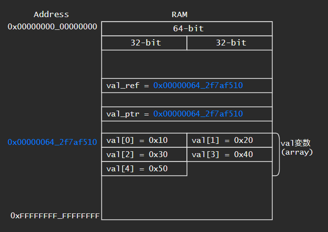
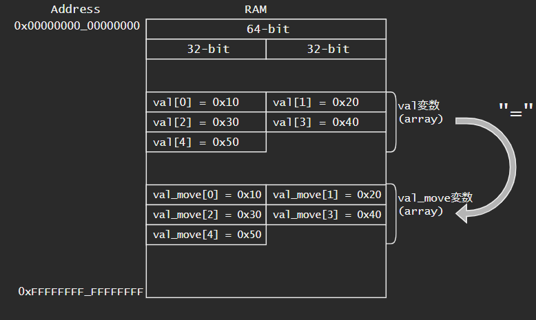
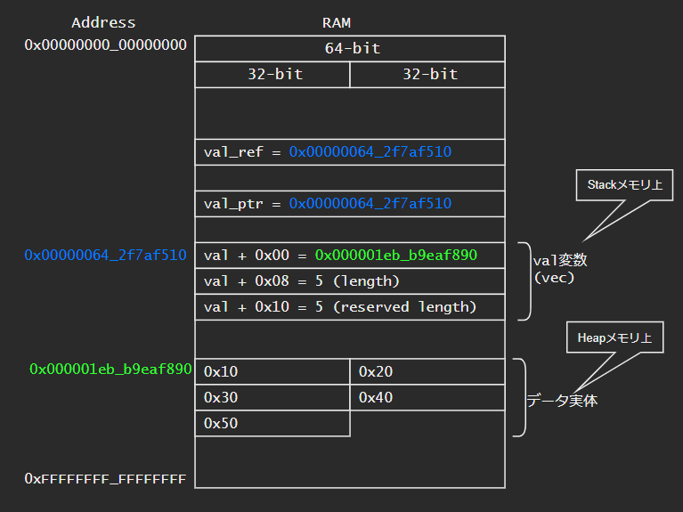

```rust:コード

```
```txt:実行結果

```

# Rustの動作をメモリの観点から見る
Rustの変数がメモリ上でどのように配置されるかを調べました。
所有権とかRust的なことは置いといて、実際にデータがどのように扱われているかが分からないと気持ちが悪いという人向けの記事です。(主にC/C++プログラマ向け)。
下記の64-bit環境で実行した結果を記載しています。実装依存な結果も含まれているかと思われます。

## 環境
- Intel Core i7-6700
- Windows10 Home 64-bit
- rustc 1.55.0

## 結論
おおむねC/C++と同じ。
本記事の範囲だと、参照と配列(array)が少し異なる。


# ポインタの基本操作
## 変数のポインタ取得
- ポインタ型は`*const i32` 、または`*mut i32` 。`&val` から受ける際に型指定しないと参照型になってしまうので要注意
    - `*mut _` や`*const _` で一部省略して受けることは可能
- 64-bitコンピュータの場合、ポインタ型のサイズは8Byte (64-bit)


```rust:コード
let val: i32 = 0x12345678;
let val_ptr: *const i32 = &val;
println!("val = 0x{:08X}, val_ptr = {:?}", val, val_ptr);
println!("sizeof(val) = {}, sizeof(val_ptr) = {}", std::mem::size_of_val(&val), std::mem::size_of_val(&val_ptr));
```

```txt:実行結果
val = 0x12345678, val_ptr = 0x8cb2eff31c
sizeof(val) = 4, sizeof(val_ptr) = 8
```

## ポインタの操作
- ポインタ型経由でメモリにアクセスする場合には `unsafe` ブロック内で行う
- ポインタの加算は `add` を使う。+1で型のサイズ分アドレスが加算される(例. i32の場合+4)

```rust:コード
let mut val: i32 = 0x12345678;
let val_ptr: *mut i32 = &mut val;
println!("val = 0x{:08X}, val_ptr = {:?}", val, val_ptr);
unsafe {
    *val_ptr += 1;
    println!("*val_ptr + 1 = 0x{:08X}", val);
    println!("val_ptr.add(1) = {:?}", val_ptr.add(1));
    // println!("val_ptr + 1 = {:?}", val_ptr + (1 as *mut i32));  // Error:  cannot add `*mut i32` to `*mut i32`
}
```
```txt:実行結果
val = 0x12345678, val_ptr = 0x8cb2eff42c
*val_ptr + 1 = 0x12345679            # 0x12345678 + 1 = 0x12345679
val_ptr.add(1) = 0x8cb2eff430        # 0x8cb2eff42c + sizeof(i32) = 0x8cb2eff430
```

## ポインタのキャスト
```rust:コード
let mut val: i32 = 0x12345678;
let val_ptr: *mut i32 = &mut val;
let val_u8_ptr: *mut u8 = val_ptr as *mut u8;
println!("val = 0x{:08X}, val_ptr = {:?}, val_u8_ptr = {:?}", val, val_ptr, val_u8_ptr);
unsafe {
    for i in 0..4 {
        println!("val_u8_ptr.add({}) = {:?}, val = 0x{:02X}", i, val_u8_ptr.add(i), *val_u8_ptr.add(i));
    }
}
```
```txt:実行結果
val = 0x12345678, val_ptr = 0x8cb2eff564, val_u8_ptr = 0x8cb2eff564
val_u8_ptr.add(0) = 0x8cb2eff564, val = 0x78
val_u8_ptr.add(1) = 0x8cb2eff565, val = 0x56
val_u8_ptr.add(2) = 0x8cb2eff566, val = 0x34
val_u8_ptr.add(3) = 0x8cb2eff567, val = 0x12
```

## 数値からポインタへのキャスト
```rust:コード
unsafe {
    /* immutable */
    let ptr: *const u32 = 0x0000_0000_0000_0000 as *const u32;
    println!("{}", *ptr);

    /* mutable */
    let ptr: *mut u32 = 0x0000_0000_0000_0000 as *mut u32;
    *ptr = 0xdeadbeef;
}
```
```txt:実行結果
error: process didn't exit successfully: `target\debug\test_memory.exe` (exit code: 0xc0000005, STATUS_ACCESS_VIOLATION)
```

# i32
## i32のメモリ配置
- i32変数(`val` )のサイズは32-bit。64-bitコンピュータの場合、ポインタ型(`val_ptr` )のサイズは8Byte (64-bit)
- 参照型(`val_ref` )のサイズは64-bitであり、参照先 (`val` )へのアドレスが格納されている。参照型(`val_ref` )のサイズは8Byte (64-bit)
- 参照型(`val_ref` )をそのまま使うと、参照先 (`val` )同等に扱える
    - `val_ref` と `*val_ref` の結果は同じ
    - そのため、参照型(`val_ref` )に格納されているアドレスを直接見ることはできない(`val` の値が取れてしまうため)。下記コードではわざわざ参照型変数へのポインタ(`val_ref_ptr` )を `*const usize`に変換して中身を見ている


<details><summary>お試しコードと実行結果</summary><div>

```rust:コード
let val: i32 = 0x12345678;
let val_ptr: *const i32 = &val;
let val_ref = &val;
let val_ref_ptr: *const &i32 = &val_ref;

println!("val = 0x{:08X}, val_ptr = {:?}, val_ref = 0x{:08X}, val_ref_ptr = {:?}", val, val_ptr, val_ref, val_ref_ptr);
println!("sizeof(val) = {}, sizeof(val_ptr) = {}, sizeof(val_ref) = {}, sizeof(val_ref_ptr) = {}",
    std::mem::size_of_val(&val), std::mem::size_of_val(&val_ptr), std::mem::size_of_val(&val_ref), std::mem::size_of_val(&val_ref_ptr));

unsafe {
    println!("val_ptr = 0x{:016X}, *val_ptr = 0x{:016X}", val_ptr as usize, *val_ptr);
    println!("val_ref = 0x{:016X}, *val_ref = 0x{:016X}", val_ref, *val_ref); // get same result
    println!("val_ref_ptr = {:?}, *val_ref_ptr = 0x{:016X}", val_ref_ptr, *val_ref_ptr); // *val_ref_ptr becomes val (not val_ref = val_ptr)
    let val_ref_ptr = val_ref_ptr as *const usize;
    println!("val_ref_ptr = {:?}, *val_ref_ptr = 0x{:016X}", val_ref_ptr, *val_ref_ptr);
}
```
```txt:実行結果
val = 0x12345678, val_ptr = 0x38fe6fdbc4, val_ref = 0x12345678, val_ref_ptr = 0x38fe6fdbd0
sizeof(val) = 4, sizeof(val_ptr) = 8, sizeof(val_ref) = 8, sizeof(val_ref_ptr) = 8
val_ptr = 0x00000038FE6FDBC4, *val_ptr = 0x0000000012345678
val_ref = 0x0000000012345678, *val_ref = 0x0000000012345678　　　　　　　　　　　# val_refにはアドレスが格納されているはずが、valの値が取れる
val_ref_ptr = 0x38fe6fdbd0, *val_ref_ptr = 0x0000000012345678                  # val_refの中身を見ようとしてもそのままだと見れない
val_ref_ptr = 0x38fe6fdbd0, *val_ref_ptr = 0x00000038FE6FDBC4                  # いったん、usizeにキャストしてから見ると、確かにvalのアドレスが格納されている
```

</div></details>

### 参考: C++参照型の場合
- C++の場合、参照型は参照先の変数と同じものとして扱われる (要出典。実装依存かも)
    - C++だとval_ptr = val_ref_ptr
    - Rustだとval_ptr != val_ref_ptr

<details><summary>お試しコードと実行結果</summary><div>

```C:Cでの参照型
#include <cstdio>
int main()
{
    int val = 0x12345678;
    int* val_ptr = &val;
    int& val_ref = val;
    int* val_ref_ptr = (int*)&val_ref;
    printf("%d %d %d\n", sizeof(val), sizeof(val_ptr), sizeof(val_ref));
    printf("val = 0x%08X\n", val);
    printf("val_ptr = %p\n", val_ptr);
    printf("val_ref = %p\n", val_ref);
    printf("val_ref_ptr = %p\n", val_ref_ptr);
    printf("*val_ref_ptr = %p\n", *val_ref_ptr);
    
    return 0;
}
```
```txt:実行結果
4 8 4
val = 0x12345678
val_ptr = 00000073463BFC50
val_ref = 0000000012345678
val_ref_ptr = 00000073463BFC50
*val_ref_ptr = 0000000012345678
```

</div></details>


## i32のMove (val_move = val)
- i32のmoveはコピーになる
    - `val_move_ptr` と`val_ptr` が異なる
    - move後も`val` にアクセス可能


<details><summary>お試しコードと実行結果</summary><div>

```rust:コード
let val: i32 = 12345678;
let val_ptr: *const i32 = &val;
println!("val = {}, val_ptr = {:?}", val, val_ptr);

let val_move = val;
let val_move_ptr: *const _ = &val_move;
println!("val = {}, val_ptr = {:?}", val, val_ptr);
println!("val_move = {}, val_move_ptr = {:?}", val_move, val_move_ptr);
```
```txt:実行結果
val = 12345678, val_ptr = 0xa550cff8a4
val = 12345678, val_ptr = 0xa550cff8a4
val_move = 12345678, val_move_ptr = 0xa550cff914
```

</div></details>


# array (配列)
## arrayのメモリ配置
- array変数(`val` )には、データそのものが格納される。
    - sizeof(`val` ) = データ数 * sizeof(型)
        - 下記のコードだと、5個 x sizeof(i32) = 5 x 4 = 20 Byteになる
    - C++の配列と同じ
- vec変数(`val` )に`as_ptr()` を行うと(`val.as_ptr()` )、array変数(`val` ) のポインタ(`val_ptr` )と同じになる
- 参照型(`val_ref_ptr` )は`val` 同等に扱えるが、実際は`val` へのポインタが格納されている
    - i32と同じ



<details><summary>お試しコードと実行結果</summary><div>

```rust:コード
let val: [i32; 5] = [0x10, 0x20, 0x30, 0x40, 0x50];
let val_ptr: *const _ = &val;
let val_ref: _ = &val;
let val_ref_ptr: *const _ = &val_ref;
let val_as_ptr: *const _ = val.as_ptr();
println!("val = {:?}, val_ptr = {:?}, val_ref = {:?}, val_ref_ptr = {:?}, val_as_ptr = {:?}", val, val_ptr, val_ref, val_ref_ptr, val_as_ptr);
println!("sizeof(val) = {}, sizeof(val_ptr) = {}, sizeof(val_ref) = {}, sizeof(val_ref_ptr) = {}",
    std::mem::size_of_val(&val), std::mem::size_of_val(&val_ptr), std::mem::size_of_val(&val_ref), std::mem::size_of_val(&val_ref_ptr));
unsafe {
    println!("== Display val_ptr ==");
    let val_u32_ptr = val_ptr as *const u32;
    for i in 0..std::mem::size_of_val(&val) / std::mem::size_of::<u32>() {
        println!("val_u32_ptr.add({}) = {:?}, val = 0x{:08X}", i, val_u32_ptr.add(i), *val_u32_ptr.add(i));
    }
    println!("== Display val.as_ptr() ==");
    let val_as_ptr = val.as_ptr();
    for i in 0..val.len() {
        println!("val_as_ptr.add({}) = {:?}, val = 0x{:08X}", i, val_as_ptr.add(i), *val_as_ptr.add(i));
    }

    println!("==Display reference==");
    let val_ref_ptr = val_ref_ptr as *const usize;
    println!("val_ref_ptr = {:?}, *val_ref_ptr = 0x{:016X}", val_ref_ptr, *val_ref_ptr);
}
```
```txt:実行結果
val = [16, 32, 48, 64, 80], val_ptr = 0xd4e09cf0d4, val_ref = [16, 32, 48, 64, 80], val_ref_ptr = 0xd4e09cf0f0, val_as_ptr = 0xd4e09cf0d4
sizeof(val) = 20, sizeof(val_ptr) = 8, sizeof(val_ref) = 8, sizeof(val_ref_ptr) = 8
== Display val_ptr ==
val_u32_ptr.add(0) = 0xd4e09cf0d4, val = 0x00000010
val_u32_ptr.add(1) = 0xd4e09cf0d8, val = 0x00000020
val_u32_ptr.add(2) = 0xd4e09cf0dc, val = 0x00000030
val_u32_ptr.add(3) = 0xd4e09cf0e0, val = 0x00000040
val_u32_ptr.add(4) = 0xd4e09cf0e4, val = 0x00000050
== Display val.as_ptr() ==
val_as_ptr.add(0) = 0xd4e09cf0d4, val = 0x00000010
val_as_ptr.add(1) = 0xd4e09cf0d8, val = 0x00000020
val_as_ptr.add(2) = 0xd4e09cf0dc, val = 0x00000030
val_as_ptr.add(3) = 0xd4e09cf0e0, val = 0x00000040
val_as_ptr.add(4) = 0xd4e09cf0e4, val = 0x00000050
==Display reference==
val_ref_ptr = 0xd4e09cf0f0, *val_ref_ptr = 0x000000D4E09CF0D4
```

</div></details>


## arrayのMove (val_move = val)
- arrayのmoveはコピーになる
    - `val_move_ptr` と`val_ptr` が異なる
    - move後も`val` にアクセス可能




<details><summary>お試しコードと実行結果</summary><div>

```rust:コード
println!("Before Move");
let val: [i32; 5] = [0x10, 0x20, 0x30, 0x40, 0x50];
let val_ptr: *const _ = &val;
println!("val = {:?}, val_ptr = {:?}, val.as_ptr() = {:?}", val, val_ptr, val.as_ptr());

println!("After Move");
let val_move = val;
let val_move_ptr: *const _ = &val_move;
println!("val = {:?}, val_ptr = {:?}, val.as_ptr() = {:?}", val, val_ptr, val.as_ptr());
println!("val_move = {:?}, val_move_ptr = {:?}, val_move.as_ptr() = {:?}", val_move, val_move_ptr, val_move.as_ptr());
println!("sizeof(val) = {}, sizeof(val_move) = {}", std::mem::size_of_val(&val), std::mem::size_of_val(&val_move));
```
```txt:実行結果
Before Move
val = [16, 32, 48, 64, 80], val_ptr = 0x6d1bbcc834, val.as_ptr() = 0x6d1bbcc834
After Move
val = [16, 32, 48, 64, 80], val_ptr = 0x6d1bbcc834, val.as_ptr() = 0x6d1bbcc834
val_move = [16, 32, 48, 64, 80], val_move_ptr = 0x6d1bbcc900, val_move.as_ptr() = 0x6d1bbcc900
sizeof(val) = 20, sizeof(val_move) = 20
```

</div></details>

### 参考: C++配列の場合
- C++の場合、`int val[5]` としたら
    - 変数`val` そのものはポインタとして扱われる
        - `val` = `&val` = `&val[0]`
        - ただし、`sizeof(val)` は20
    - `int val_move = val` とした、
        - `val_move` = `&val[0]`
        - `&val_move` = 新しいポインタ (`val_move` の値を格納している場所)
        - `&val_move[0]` = `&val[0]`
        - `sizeof(val_move)` は8 (64-bit)
        - つまり、データの実体はコピーされない

# vec
## vecのメモリ配置
- vec変数(`val` )のサイズは24 Byte = 8 Byte x 3フィールド
    - +0x00: データ実体が格納されているアドレス (64-bit)
        - `val.as_ptr()` と同じ
    - +0x08: データのlength
    - +0x10: データのlength (おそらくreservedサイズ)
    - * 恐らくC++のstd::vectorと同じ
- vec変数(`val` )に`as_ptr()` を行うと(`val.as_ptr()` )、データ実体が格納されているアドレスが取れる
    - vec変数(`val` )のポインタ(`val_ptr` )とは異なる
- 参照型(`val_ref_ptr` )は`val` 同等に扱えるが、実際は`val` へのポインタが格納されている
    - i32と同じ
- ちなみに、下記コードは変数をmutableにするとエラーになる
    - `val` を`val_ref` にborrowしたあとに、`val` にアクセスしているため



<details><summary>お試しコードと実行結果</summary><div>

```rust:コード
let val: Vec<i32> = vec![0x10, 0x20, 0x30, 0x40, 0x50];
let val_ptr: *const _ = &val;
let val_ref= &val;
let val_ref_ptr: *const &Vec<i32> = &val_ref;
println!("val = {:?}, val_ptr = {:?}, val_ref = {:?}, val_ref_ptr = {:?}", val, val_ptr, val_ref, val_ref_ptr);
println!("sizeof(val) = {}, sizeof(val_ptr) = {}, sizeof(val_ref) = {}, sizeof(val_ref_ptr) = {}",
    std::mem::size_of_val(&val), std::mem::size_of_val(&val_ptr), std::mem::size_of_val(&val_ref), std::mem::size_of_val(&val_ref_ptr));
unsafe {
    println!("== Display val_ptr ==");
    let val_u32_ptr = val_ptr as *const u32;
    for i in 0..std::mem::size_of_val(&val) / std::mem::size_of::<u32>() {
        println!("val_u8_ptr.add({}) = {:?}, val = 0x{:08X}", i, val_u32_ptr.add(i), *val_u32_ptr.add(i));
    }
    println!("== Display val.as_ptr() ==");
    let val_as_ptr = val.as_ptr();
    for i in 0..val.len() {
        println!("val_as_ptr.add({}) = {:?}, val = 0x{:08X}", i, val_as_ptr.add(i), *val_as_ptr.add(i));
    }

    println!("==Display reference==");
    let val_ref_ptr = val_ref_ptr as *const usize;
    println!("val_ref_ptr = {:?}, *val_ref_ptr = 0x{:016X}", val_ref_ptr, *val_ref_ptr);
}
```
```txt:実行結果
val = [16, 32, 48, 64, 80], val_ptr = 0x6712aff018, val_ref = [16, 32, 48, 64, 80], val_ref_ptr = 0x6712aff038
sizeof(val) = 24, sizeof(val_ptr) = 8, sizeof(val_ref) = 8, sizeof(val_ref_ptr) = 8
== Display val_ptr ==
val_u8_ptr.add(0) = 0x6712aff018, val = 0x1B50FD20
val_u8_ptr.add(1) = 0x6712aff01c, val = 0x00000180
val_u8_ptr.add(2) = 0x6712aff020, val = 0x00000005
val_u8_ptr.add(3) = 0x6712aff024, val = 0x00000000
val_u8_ptr.add(4) = 0x6712aff028, val = 0x00000005
val_u8_ptr.add(5) = 0x6712aff02c, val = 0x00000000
== Display val.as_ptr() ==
val_as_ptr.add(0) = 0x1801b50fd20, val = 0x00000010
val_as_ptr.add(1) = 0x1801b50fd24, val = 0x00000020
val_as_ptr.add(2) = 0x1801b50fd28, val = 0x00000030
val_as_ptr.add(3) = 0x1801b50fd2c, val = 0x00000040
val_as_ptr.add(4) = 0x1801b50fd30, val = 0x00000050
==Display reference==
val_ref_ptr = 0x6712aff038, *val_ref_ptr = 0x0000006712AFF018
```

</div></details>


## vecのMove (val_move = val)
- vecのmoveは、
    - vec変数の中身はコピーされる (24Byteのデータ: データ実体へのポインタとサイズ)
    - データの実体はコピーされない
- move後、`val` にアクセス不可能


<details><summary>お試しコードと実行結果</summary><div>

```rust:コード
let val: Vec<i32> = vec![0x10, 0x20, 0x30, 0x40, 0x50];
let val_ptr: *const _ = &val;
println!("val = {:?}, val_ptr = {:?}, val.as_ptr() = {:?}", val, val_ptr, val.as_ptr());

let val_move = val;
let val_move_ptr: *const _ = &val_move;
// println!("val = {:?}, val_ptr = {:?}, val.as_ptr() = {:?}", val, val_ptr, val.as_ptr()); // Error: borrow of moved value
println!("val1 = {:?}, val1_ptr = {:?}, val1.as_ptr() = {:?}", val_move, val_move_ptr, val_move.as_ptr());
println!("sizeof(val1) = {}, ", std::mem::size_of_val(&val_move));

unsafe {
    println!("== Display val_ptr ==");
    let val_u32_ptr = val_ptr as *const u32;
    for i in 0..std::mem::size_of_val(&val_move) / std::mem::size_of::<u32>() {
        println!("val_u32_ptr.add({}) = {:?}, val = 0x{:08X}", i, val_u32_ptr.add(i), *val_u32_ptr.add(i));
    }

    // === Error: borrow of moved value ===
    // println!("== Display val.as_ptr() ==");
    // let val_as_ptr = val.as_ptr();
    // for i in 0..val_move.len() {
    //     println!("val_as_ptr.add({}) = {:?}, val = 0x{:08X}", i, val_as_ptr.add(i), *val_as_ptr.add(i));
    // }

    println!("== Display val_move_ptr ==");
    let val_move_u32_ptr = val_move_ptr as *const u32;
    for i in 0..std::mem::size_of_val(&val_move) / std::mem::size_of::<u32>() {
        println!("val_move_u32_ptr.add({}) = {:?}, val = 0x{:08X}", i, val_move_u32_ptr.add(i), *val_move_u32_ptr.add(i));
    }
    println!("== Display val_move.as_ptr() ==");
    let val_move_as_ptr = val_move.as_ptr();
    for i in 0..val_move.len() {
        println!("val_move_as_ptr.add({}) = {:?}, val = 0x{:08X}", i, val_move_as_ptr.add(i), *val_move_as_ptr.add(i));
    }
}
```
```txt:実行結果
val = [16, 32, 48, 64, 80], val_ptr = 0xaa0afee90, val.as_ptr() = 0x138d683df90
val1 = [16, 32, 48, 64, 80], val1_ptr = 0xaa0afef30, val1.as_ptr() = 0x138d683df90
sizeof(val1) = 24,
== Display val_ptr ==
val_u32_ptr.add(0) = 0xaa0afee90, val = 0xD683DF90
val_u32_ptr.add(1) = 0xaa0afee94, val = 0x00000138
val_u32_ptr.add(2) = 0xaa0afee98, val = 0x00000005
val_u32_ptr.add(3) = 0xaa0afee9c, val = 0x00000000
val_u32_ptr.add(4) = 0xaa0afeea0, val = 0x00000005
val_u32_ptr.add(5) = 0xaa0afeea4, val = 0x00000000
== Display val_move_ptr ==
val_move_u32_ptr.add(0) = 0xaa0afef30, val = 0xD683DF90
val_move_u32_ptr.add(1) = 0xaa0afef34, val = 0x00000138
val_move_u32_ptr.add(2) = 0xaa0afef38, val = 0x00000005
val_move_u32_ptr.add(3) = 0xaa0afef3c, val = 0x00000000
val_move_u32_ptr.add(4) = 0xaa0afef40, val = 0x00000005
val_move_u32_ptr.add(5) = 0xaa0afef44, val = 0x00000000
== Display val_move.as_ptr() ==
val_move_as_ptr.add(0) = 0x138d683df90, val = 0x00000010
val_move_as_ptr.add(1) = 0x138d683df94, val = 0x00000020
val_move_as_ptr.add(2) = 0x138d683df98, val = 0x00000030
val_move_as_ptr.add(3) = 0x138d683df9c, val = 0x00000040
val_move_as_ptr.add(4) = 0x138d683dfa0, val = 0x00000050
```

</div></details>

# その他
&str、 String、 structも、vecと同様。structについてのみ下記に結果を示す。


# struct

```rust:struct定義
#[derive(Debug)]
struct Person {
    id: i32,
    age: i32,
    name: String,
}
```

<details><summary>お試しコードと実行結果</summary><div>

## structのメモリ配置
```rust:コード
println!("\n### struct: Memory Allocation ###");
let val = Person{ id: 1, age: 2, name: "ABC".to_string() };
let val_ptr: *const _ = &val;
let val_id_ptr: *const i32 = &val.id;
let val_age_ptr: *const i32 = &val.age;
let val_str_ptr: *const String = &val.name;
println!("val_ptr = {:?}, val_id_ptr = {:?}, val_age_ptr = {:?}, val_str_ptr = {:?}, val.name.as_ptr() = {:?}", val_ptr, val_id_ptr, val_age_ptr, val_str_ptr, val.name.as_ptr());
println!("sizeof(val) = {}", std::mem::size_of_val(&val));
unsafe {
    println!("== Display val_ptr ==");
    let val_u32_ptr = val_ptr as *const u32;
    for i in 0..std::mem::size_of_val(&val) / std::mem::size_of::<u32>() {
        println!("val_u8_ptr.add({}) = {:?}, val = 0x{:08X}", i, val_u32_ptr.add(i), *val_u32_ptr.add(i));
    }
}
```
```txt:実行結果
val_ptr = 0x9bcb6fe450, val_id_ptr = 0x9bcb6fe468, val_age_ptr = 0x9bcb6fe46c, val_str_ptr = 0x9bcb6fe450, val.name.as_ptr() = 0x1cc03be6700
sizeof(val) = 32
== Display val_ptr ==
val_u8_ptr.add(0) = 0x9bcb6fe450, val = 0x03BE6700
val_u8_ptr.add(1) = 0x9bcb6fe454, val = 0x000001CC
val_u8_ptr.add(2) = 0x9bcb6fe458, val = 0x00000003
val_u8_ptr.add(3) = 0x9bcb6fe45c, val = 0x00000000
val_u8_ptr.add(4) = 0x9bcb6fe460, val = 0x00000003
val_u8_ptr.add(5) = 0x9bcb6fe464, val = 0x00000000
val_u8_ptr.add(6) = 0x9bcb6fe468, val = 0x00000001
val_u8_ptr.add(7) = 0x9bcb6fe46c, val = 0x00000002
```

</div></details>

## structのMove (val_move = val)

<details><summary>お試しコードと実行結果</summary><div>

```rust:コード
let val = Person{ id: 1, age: 2, name: "ABC".to_string() };
let val_ptr: *const Person = &val;
println!("val_ptr = {:?}, val_id_ptr = {:?}, val_age_ptr = {:?}, val_str_ptr = {:?}, val.name.as_ptr() = {:?}", val_ptr, val_id_ptr, val_age_ptr, val_str_ptr, val.name.as_ptr());
let val_move = val;
let val_move_ptr: *const _ = &val_move;
let val_move_id_ptr: *const i32 = &val_move.id;
let val_move_age_ptr: *const i32 = &val_move.age;
let val_move_str_ptr: *const String = &val_move.name;
// println!("val_ptr = {:?}, val_id_ptr = {:?}, val_age_ptr = {:?}, val_str_ptr = {:?}, val.name.as_ptr() = {:?}", val_ptr, val_id_ptr, val_age_ptr, val_str_ptr, val.name.as_ptr());
println!("val_move_ptr = {:?}, val_move_id_ptr = {:?}, val_move_age_ptr = {:?}, val_move_str_ptr = {:?}, val_move.name.as_ptr() = {:?}", val_move_ptr, val_move_id_ptr, val_move_age_ptr, val_move_str_ptr, val_move.name.as_ptr());

unsafe {
    println!("== Display val_ptr ==");
    let val_u32_ptr = val_ptr as *const u32;
    for i in 0..std::mem::size_of_val(&val_move) / std::mem::size_of::<u32>() {
        println!("val_u32_ptr.add({}) = {:?}, val = 0x{:08X}", i, val_u32_ptr.add(i), *val_u32_ptr.add(i));
    }

    println!("== Display val_move_ptr ==");
    let val_move_u32_ptr = val_move_ptr as *const u32;
    for i in 0..std::mem::size_of_val(&val_move) / std::mem::size_of::<u32>() {
        println!("val_move_u32_ptr.add({}) = {:?}, val = 0x{:08X}", i, val_move_u32_ptr.add(i), *val_move_u32_ptr.add(i));
    }
}
```
```txt:実行結果
val_ptr = 0x9bcb6fe6c0, val_id_ptr = 0x9bcb6fe468, val_age_ptr = 0x9bcb6fe46c, val_str_ptr = 0x9bcb6fe450, val.name.as_ptr() = 0x1cc03be6720
val_move_ptr = 0x9bcb6fe7b0, val_move_id_ptr = 0x9bcb6fe7c8, val_move_age_ptr = 0x9bcb6fe7cc, val_move_str_ptr = 0x9bcb6fe7b0, val_move.name.as_ptr() = 0x1cc03be6720
== Display val_ptr ==
val_u32_ptr.add(0) = 0x9bcb6fe6c0, val = 0x03BE6720
val_u32_ptr.add(1) = 0x9bcb6fe6c4, val = 0x000001CC
val_u32_ptr.add(2) = 0x9bcb6fe6c8, val = 0x00000003
val_u32_ptr.add(3) = 0x9bcb6fe6cc, val = 0x00000000
val_u32_ptr.add(4) = 0x9bcb6fe6d0, val = 0x00000003
val_u32_ptr.add(5) = 0x9bcb6fe6d4, val = 0x00000000
val_u32_ptr.add(6) = 0x9bcb6fe6d8, val = 0x00000001
val_u32_ptr.add(7) = 0x9bcb6fe6dc, val = 0x00000002
== Display val_move_ptr ==
val_move_u32_ptr.add(0) = 0x9bcb6fe7b0, val = 0x03BE6720
val_move_u32_ptr.add(1) = 0x9bcb6fe7b4, val = 0x000001CC
val_move_u32_ptr.add(2) = 0x9bcb6fe7b8, val = 0x00000003
val_move_u32_ptr.add(3) = 0x9bcb6fe7bc, val = 0x00000000
val_move_u32_ptr.add(4) = 0x9bcb6fe7c0, val = 0x00000003
val_move_u32_ptr.add(5) = 0x9bcb6fe7c4, val = 0x00000000
val_move_u32_ptr.add(6) = 0x9bcb6fe7c8, val = 0x00000001
val_move_u32_ptr.add(7) = 0x9bcb6fe7cc, val = 0x00000002
```

</div></details>

